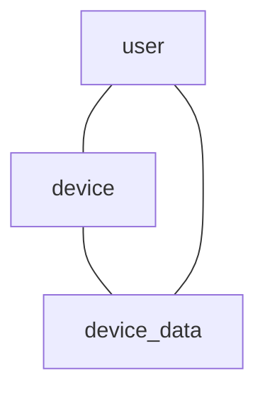

### Домен «Интеграция»

### Диаграмма связей


#### Сущность «Устройство» (Device)

**Описание:** устройства, которые пользователь использует для отслеживания тренировок (например, смарт-часы, фитнес-браслеты и т. д.).

| Свойство | Тип | Описание |
| --- | --- | --- |
| id | UUID | Уникальный идентификатор устройства. |
| userId | UUID | ID пользователя, которому принадлежит устройство. Связь с User. |
| type | Enum | Тип устройства: смарт-часы, фитнес-браслет и т. д. |
| brand | String | Бренд устройства. |
| model | String | Модель устройства. |
| connectionStatus | Enum | Статус подключения: подключено, отключено. |

**Пример:**
```
{
  "id": "g50e8400-e29b-41d4-a716-446655440001",
  "userId": "g50e8400-e29b-41d4-a716-446655440002",
  "type": "смарт-часы",
  "brand": "Apple",
  "model": "Watch Series 9",
  "connectionStatus": "подключено"
}
```

#### Сущность «Приложение» (App)

**Описание:** сторонние приложения, с которыми интегрировано наше приложение (например, Strava, Runkeeper, Apple Health, Google Fit и т. д.).

| Свойство | Тип | Описание |
| --- | --- | --- |
| id | UUID | Уникальный идентификатор приложения. |
| name | String | Название приложения (макс. 50 символов). |
| apiKey | String | Ключ API для интеграции с приложением. |
| secretKey | String | Секретный ключ для интеграции с приложением. |

**Пример:**
```
{
  "id": "h50e8400-e29b-41d4-a716-446655440003",
  "name": "Apple Health",
  "apiKey": "abc123",
  "secretKey": "xyz789"
}
```

#### Сущность «Данные с устройства» (Device Data)

**Описание:** данные, полученные от устройств пользователя (например, смарт-часов, фитнес-браслетов и т. д.).

| Свойство | Тип | Описание |
| --- | --- | --- |
| id | UUID | Уникальный идентификатор данных. |
| userId | UUID | ID пользователя, которому принадлежат данные. Связь с User. |
| deviceId | UUID | ID устройства, с которого получены данные. Связь с Device. |
| dataType | Enum | Тип данных: сердечный ритм, пройденное расстояние, количество шагов и т. д. |
| value | Float/Integer | Значение данных. |
| timestamp | DateTime | Время получения данных. |

**Пример:**
```
{
  "id": "i50e8400-e29b-41d4-a716-446655440004",
  "userId": "i50e8400-e29b-41d4-a716-446655440005",
  "deviceId": "i50e8400-e29b-41d4-a716-446655440006",
  "dataType": "пройденное расстояние",
  "value": 5.2,
  "timestamp": "2024-11-01T10:00:00Z"
}
```
