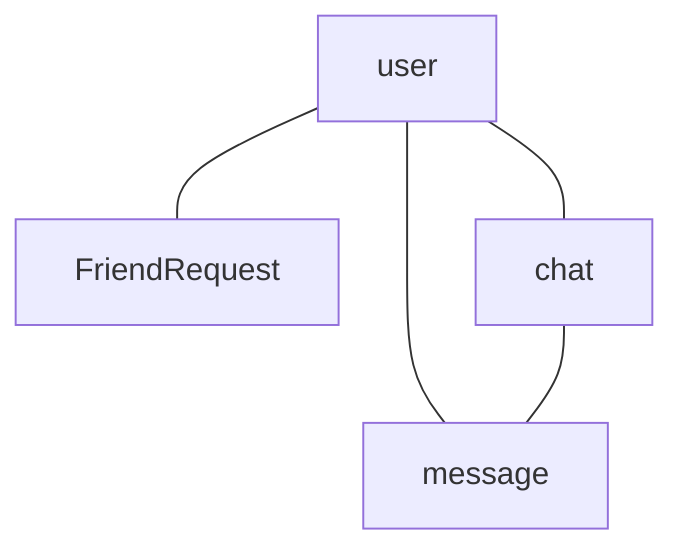

## Домен социальный
### Диаграмма связи сущностей

### Cущности
#### Cообщение
Отправленное сообщение в личном или групповом чате.

|Свойство   |	Тип     |	Описание |
|------     |------     |------|
| id        | UUID      |	Уникальный идентификатор сообщения. (550e8400-e29b-41d4-a716-446655440000)|
| senderId  | UUID      |	ID пользователя-отправителя. Связь с User. |
| chatId    | UUID      |	ID чата (личного или группового). Связь с Chat. |
| content	| String    | Текст сообщения (макс. 1000 символов). |
| timestamp | DateTime  |	Время отправки |
| status    | Enum      |   Статус: sent, delivered, read. |
| replyTo   | UUID	    |	ID сообщения, на которое ответили (для тредов). |

пример:
```
{
  "id": "550e8400-e29b-41d4-a716-446655440000",
  "senderId": "550e8400-e29b-41d4-a716-446655440001",
  "chatId": "550e8400-e29b-41d4-a716-446655440002",
  "content": "Привет!",
  "timestamp": "2025-06-01T00:00:00Z",
  "status": "delivered",
  "replyTo": null
}
```

#### Чат
Личный или групповой чат.

| Свойство      |Тип        |Описание |
|------         |------     |------|
| id            |UUID	    |Уникальный ID чата. |
|type	        |Enum	    |Тип: private, group. |
|users	        |Array<UUID>|ID участников (минимум 2 для личного чата). |
|title	        |String	    |Название группы (если type=group). |
|createdAt	    |DateTime   |Время создания чата.|
|lastMessageId  |UUID	    |ID последнего сообщения (для сортировки чатов). |

пример:
```
{
  "id": "650e8400-e29b-41d4-a716-446655440000",
  "type": "group",
  "users": ["650e8400-e29b-41d4-a716-446655440001", "650e8400-e29b-41d4-a716-446655440002"],
  "title": "Бегуны",
  "createdAt": "2025-03-15T10:00:00Z",
  "lastMessageId": "msg_123"
}
```

#### Пользователь

Профиль пользователя для социальных функций.

| Свойство      |Тип        |Описание |
|------         |------     |------|
|id             |UUID       |Уникальный ID пользователя. |
|name	        |String		|Имя (макс. 50 символов). |
|avatar	        |Object	    |аватар фото пользователя|
|friends	    |Array<UUID>|ID друзей.|
|blockedUsers   |Array<UUID>|ID заблокированных пользователей.|
|privacySettings|Object     |Настройки приватности: { showActivity: boolean }.|

пример:
```
{
  "id": "650e8400-e29b-41d4-a716-446655440000",
  "name": "Иван Иванов",
  "avatarUrl": "user.jpg",
  "friends": ["650e8400-e29b-41d4-a716-446655440002", "650e8400-e29b-41d4-a716-446655440004"],
  "blockedUsers": [],
  "privacySettings": {
    "showActivity": true,
    "allowMessages": "friends_only"
  }
}
```

#### FriendRequest (Запрос в друзья)
Запрос на добавление в друзья.

| Свойство      |Тип        |Описание |
|------         |------     |------|
|id	        |UUID	    |Уникальный ID запроса.|
|fromUserId	|UUID	    |ID отправителя.|
|toUserId	|UUID	    |ID получателя.|
|status	    |Enum	    |Статус: pending, accepted, rejected.|
|createdAt  |DateTime   |Время отправки.|

пример:
```
{
  "id": "650e8400-e29b-41d4-a716-446655440002",
  "fromUserId": "650e8400-e29b-41d4-a716-446655440003",
  "toUserId": "650e8400-e29b-41d4-a716-446655440005",
  "status": "pending",
  "createdAt": "2025-02-10T12:00:00Z"
}
```

