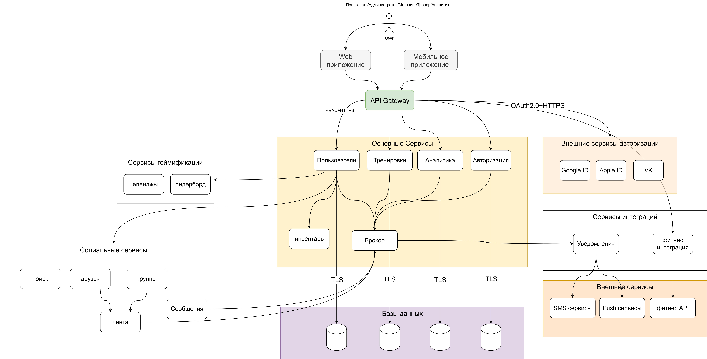

# Многозадачность и безопастность

## Объяснение схемы
### Пользователи (User): 
Представлены как обычные пользователи, тренеры, администраторы, мактетинг, аналитик. Они взаимодействуют с системой через API Gateway с помощью HTTP-запросов (например, через мобильное приложение или веб-интерфейс).

API Gateway: Центральная точка входа, которая распределяет запросы к соответствующим микросервисам. Маршрутизирует запросы к соответствующим микросервисам, занимается   кэшированием и ограничением запросов (Rate Limiting).

## Микросервисы:
* Авторизация: Отвечает за регистрацию и авторизацию.  OAuth 2.0, JWT-токены, регистрацию, подтверждение email/SMS
* Пользователи: Управляет профилями пользователей, данными, настройками приватности.
* Тренировки: Управляет тренировками и расписаниями.
* Аналитика: Предоставляет аналитические данные.
* Уведомления: Отправляет уведомления пользователям.
* социальные сервисы: Управление друзьями (добавление/удаление/подписки), создание и управление группами/сообществами, лента активностей друзей и групп, личные сообщения между пользователями, поиск пользователей по имени/никнейму.

Базы данных (DB): Каждый сервис имеет свою собственную базу данных для обеспечения независимости.
* Брокер (RabbitMQ): Используется для асинхронного взаимодействия между сервисами. Например, сервис тренировки публикует событие о создании тренировки, а сервис уведомлений подписывается на это событие, чтобы отправить напоминание пользователю.
* Внешние сервисы авторизации: Авторизация с помощью популярных сервисов через OAuth2.0 + HTTPS

Все запросы к сервисам передаются по протоколу HTTPS.

Обращения к базам данных происходит используя TLS для аутентификации и шифрования данных.

Все сервисы располагаются в изолированная частной сети.