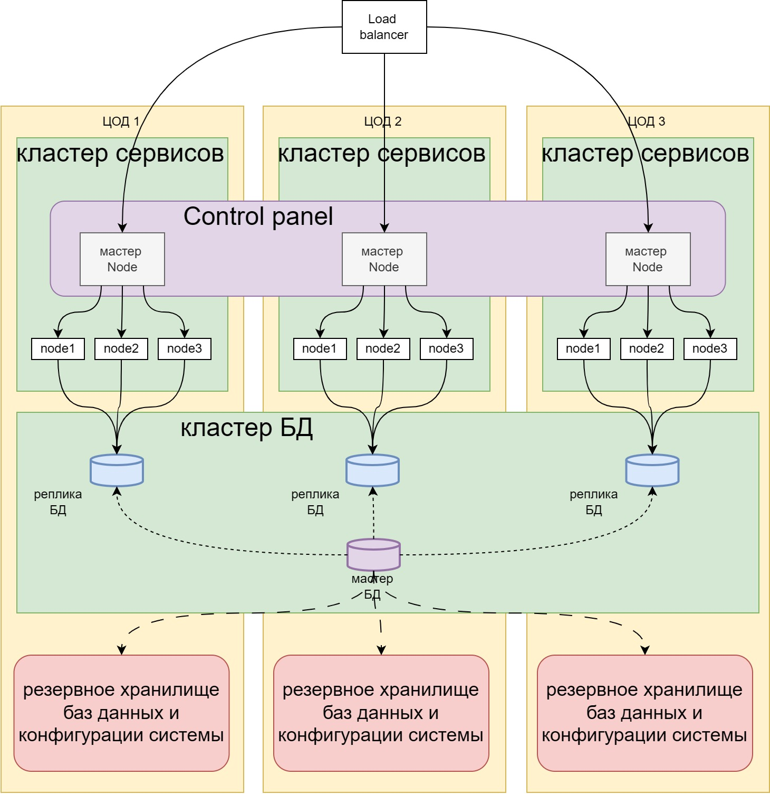

* В каждом цоде развернуты мастер ноды, которые вместе образуют единый распределенный Control Plane.
* Мастер ноды связаны между собой через кластер etcd. Для работы etcd кворума необходимо нечетное количество мастер нод поэтому минимум 3 мастер ноды.
* При отказе мастер ноды в одном цоде управление берут на себя мастер ноды из других цод.
* Рабочие ноды подключены к ближайшим мастер нодам в своем цоде.
* Базы данных располагаются в отдельном кластере
* Сервисы из рабочих нод работают с репликами БД находящихся в их цод. В случае отказа мастер БД другая реплика становится мастером БД.
* В резервное хранилище в каждом цоде ежедневно делать резервные копии баз данных и конфигурации системы.
* Ежемесячно проверять работу восстановления системы и баз данных из резервных копий на тестовом стенде.
