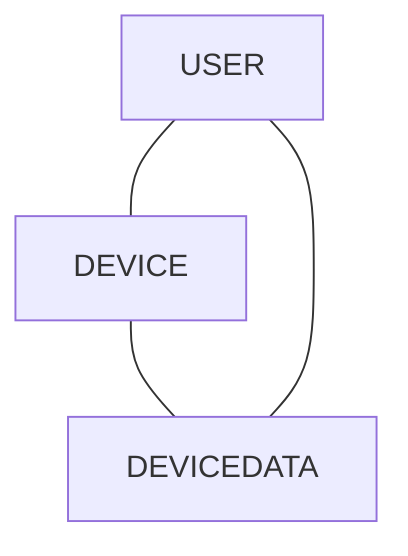

## Приложение

#### Сущность «Пользователь» (User)
**Описание:** информация о пользователе

| Свойство | Тип | Описание |
| --- | --- | --- |
| id | UUID | Уникальный идентификатор пользователя. |
| username | String | Имя пользователя. |
| email | String | Электронная почта пользователя. |

#### Сущность «Устройство» (Device)
**Описание:** Представляет устройство или источник данных (например, Health Connect, Apple Health, или конкретный фитнес-трекер, если поддерживается).

| Свойство | Тип | Описание |
| --- | --- | --- |
| deviceId | UUID | уникальный идентификатор устройства/источника |
| userId | UUID | связь с пользователем, которому принадлежит устройство |
| deviceType | string | например, "HealthConnect", "AppleHealth" и т.д. |
| deviceName | string | человеко-читаемое имя, задаваемое пользователем |
| status | string | например, "активно", "отключено |
| lastSyncDate | Date | дата последней синхронизации данных |
| updatedAt | Date | временные метки |

#### Сущность «Устройство» (Device)
**Описание:** Данные, полученные с устройств (например, шаги, пульс, калории, сон и т.д.).

| Свойство | Тип | Описание |
| --- | --- | --- |
| dataId | UUID| уникальный идентификатор записи |
| userId | UUID| связь с пользователем |
| deviceId | UUID| связь с устройством/источником |
| dataType | string | тип данных: "steps", "heartRate", "sleep", "calories", и т.д. |
| value | string | значение данных, может быть числом или JSON в зависимости от сложности |
| timestamp | Date| время, когда данные были записаны или получены |
 