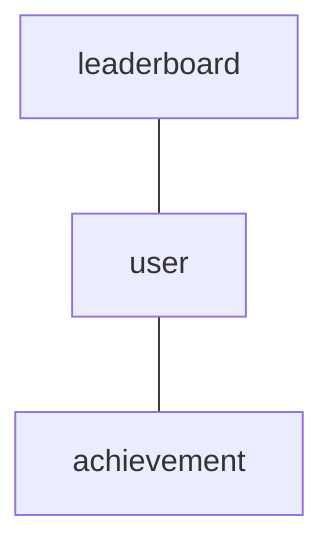

### Домен «Геймификация»
### Диаграмма связей


#### Сущность «Пользователь» (User)

**Описание:** информация о пользователе, участвующем в игровых механиках.

| Свойство | Тип | Описание |
| --- | --- | --- |
| id | UUID | Уникальный идентификатор пользователя. |
| username | String | Имя пользователя. |
| email | String | Электронная почта пользователя. |

**Пример:**
```
{
  "id": "u50e8400-e29b-41d4-a716-446655440001",
  "username": "user",
  "email": "user@mail.ru"
}
```

#### Сущность «Достижение» (Achievement)

**Описание:** достижения, которые пользователь может получать за выполнение определённых условий.

| Свойство | Тип | Описание |
| --- | --- | --- |
| id | UUID | Уникальный идентификатор достижения. |
| userId | UUID | ID пользователя, которому принадлежит достижение. Связь с User. |
| name | String | Название достижения (макс. 50 символов). |
| description | String | Описание достижения (макс. 200 символов). |
| dateEarned | DateTime | Дата получения достижения. |

**Пример:**
```
{
  "id": "a50e8400-e29b-41d4-a716-446655440001",
  "userId": "u50e8400-e29b-41d4-a716-446655440001",
  "name": "Первый забег",
  "description": "Пробежите 5 километров, чтобы получить это достижение.",
  "dateEarned": "2024-11-01T10:00:00Z"
}
```

#### Сущность «Таблица лидеров» (Leaderboard)

**Описание:** таблицы лидеров, где пользователи могут соревноваться друг с другом.

| Свойство | Тип | Описание |
| --- | --- | --- |
| id | UUID | Уникальный идентификатор таблицы лидеров. |
| userId | UUID | ID пользователя, который участвует в таблице лидеров. Связь с User. |
| rank | Integer | Ранг пользователя в таблице лидеров. |
| score | Integer | Очки пользователя в таблице лидеров. |
| metric | String | Метрика, по которой определяется ранг (например, «расстояние», «время»). |

**Пример:**
```
{
  "id": "l50e8400-e29b-41d4-a716-446655440001",
  "userId": "u50e8400-e29b-41d4-a716-446655440001",
  "rank": 1,
  "score": 100,
  "metric": "расстояние"
}
```

