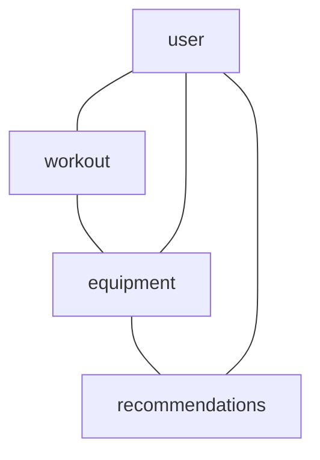

### Домен «Инвентарь»



#### Сущность «Экипировка» (Equipment)

**Описание:** спортивный инвентарь, который использует пользователь (кроссовки, велосипед, мяч и т. п.).

| Свойство | Тип | Описание |
| --- | --- | --- |
| id | UUID | Уникальный идентификатор инвентаря. |
| userId | UUID | ID пользователя, которому принадлежит инвентарь. Связь с User. |
| type | Enum | Тип инвентаря: кроссовки, велосипед, мяч и т. д. |
| brand | String | Бренд инвентаря. |
| model | String | Модель инвентаря. |
| purchaseDate | Date | Дата покупки инвентаря. |
| usageCount | Integer | Количество использований инвентаря. |

**Пример:**
```
{
  "id": "b50e8400-e29b-41d4-a716-446655440001",
  "userId": "b50e8400-e29b-41d4-a716-446655440002",
  "type": "кроссовки",
  "brand": "Adidas",
  "model": "Ultra Boost",
  "purchaseDate": "2024-10-15",
  "usageCount": 25
}
```

#### Сущность «Рекомендации» (Recommendations)

**Описание:** рекомендации по обновлению, замене или дополнению инвентаря на основе износа и предпочтений пользователя.

| Свойство | Тип | Описание |
| --- | --- | --- |
| id | UUID | Уникальный идентификатор рекомендации. |
| userId | UUID | ID пользователя, которому предназначена рекомендация. Связь с User. |
| equipmentId | UUID | ID инвентаря, к которому относится рекомендация. Связь с Equipment. |
| type | Enum | Тип рекомендации: обновить, заменить, дополнить. |
| reason | String | Причина рекомендации (например, износ, выход новой модели). |
| suggestedEquipment | Object | Рекомендуемые товары: { type: Enum, brand: String, model: String }. |

**Пример:**
```
{
  "id": "c50e8400-e29b-41d4-a716-446655440001",
  "userId": "c50e8400-e29b-41d4-a716-446655440002",
  "equipmentId": "c50e8400-e29b-41d4-a716-446655440003",
  "type": "обновить",
  "reason": "Износ подошвы",
  "suggestedEquipment": {
    "type": "кроссовки",
    "brand": "Brand",
    "model": "Model2"
  }
}
```

