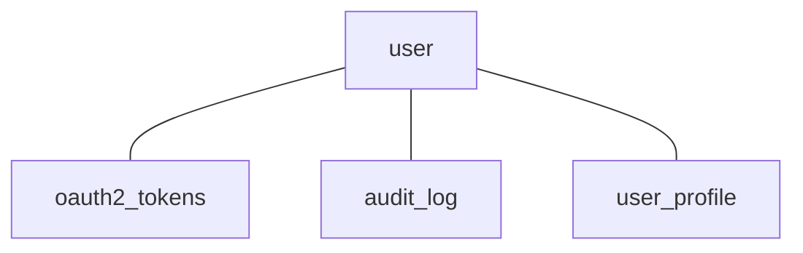

### Домен «Безопасность»

### Диаграмма связей


#### Сущность «Пользователь» (User)

**Описание:** информация о пользователе, включая данные для аутентификации и авторизации.

| Свойство | Тип | Описание |
| --- | --- | --- |
| id | UUID | Уникальный идентификатор пользователя. |
| username | String | Имя пользователя. |
| email | String | Электронная почта пользователя. |
| roles | Array | Массив ролей пользователя (например, «admin», «user»). |

**Пример:**
```
{
  "id": "m50e8400-e29b-41d4-a716-446655440001",
  "username": "user123",
  "email": "user@mail.ru",
  "roles": ["user"]
}
```

#### Сущность «OAuth 2.0 Клиент» (OAuth 2.0 Client)

**Описание:** информация о клиенте, который использует OAuth 2.0 для аутентификации пользователей.

| Свойство | Тип | Описание |
| --- | --- | --- |
| clientId | String | Идентификатор клиента. |
| clientSecret | String | Секретный ключ клиента. |
| redirectUri | String | URI для перенаправления после аутентификации. |

**Пример:**
```
{
  "clientId": "client_id",
  "clientSecret": "secret",
  "redirectUri": "https://example.ru/redirect"
}
```

#### Сущность «OAuth 2.0 Токены» (OAuth 2.0 Tokens)

**Описание:** токены, используемые для аутентификации и авторизации пользователя.

| Свойство | Тип | Описание |
| --- | --- | --- |
| id | UUID | Уникальный идентификатор токена. |
| userId | UUID | ID пользователя, которому принадлежит токен. Связь с User. |
| accessToken | String | Значение токена доступа. |
| refreshToken | String | Значение токена обновления. |
| expirationDate | DateTime | Дата истечения срока действия токена. |

**Пример:**
```
{
  "id": "n50e8400-e29b-41d4-a716-446655440001",
  "userId": "m50e8400-e29b-41d4-a716-446655440001",
  "accessToken": "access_token_here",
  "refreshToken": "refresh_token_here",
  "expirationDate": "2025-12-01T10:00:00Z"
}
```

#### Сущность «Журнал аудита» (Audit Log)

**Описание:** записи о действиях пользователей, которые могут быть полезны для анализа безопасности.

| Свойство | Тип | Описание |
| --- | --- | --- |
| id | UUID | Уникальный идентификатор записи. |
| userId | UUID | ID пользователя, который выполнил действие. Связь с User. |
| action | String | Описание действия (например, «login», «logout», «update_profile»). |
| timestamp | DateTime | Время выполнения действия. |

**Пример:**
```
{
  "id": "o50e8400-e29b-41d4-a716-446655440001",
  "userId": "m50e8400-e29b-41d4-a716-446655440001",
  "action": "login",
  "timestamp": "2025-02-01T10:00:00Z"
}
```
 

#### Сущность «Профиль пользователя» (User Profile)

**Описание:** дополнительная информация о пользователе.

| Свойство | Тип | Описание |
| --- | --- | --- |
| userId | UUID | ID пользователя, которому принадлежит профиль. Связь с User. |
| firstName | String | Имя пользователя. |
| lastName | String | Фамилия пользователя. |
| dateOfBirth | Date | Дата рождения пользователя. |
| gender | Enum | Пол пользователя: мужской, женский. |
| avatar | String | URL изображения профиля пользователя. |
| preferredLanguage | String | Предпочитаемый язык пользователя. |
| region | String | Регион пользователя. |
| sportPreferences | Array | Предпочтения пользователя в спорте (например, футбол, баскетбол, йога). |

**Пример:**
```json
{
  "userId": "p50e8400-e29b-41d4-a716-446655440001",
  "firstName": "Иван",
  "lastName": "Иванов",
  "dateOfBirth": "1990-01-01",
  "gender": "мужской",
  "profilePicture": "picture.jpg",
  "preferredLanguage": "ru",
  "region": "Москва",
  "sportPreferences": ["футбол", "баскетбол"]
}
```
 
