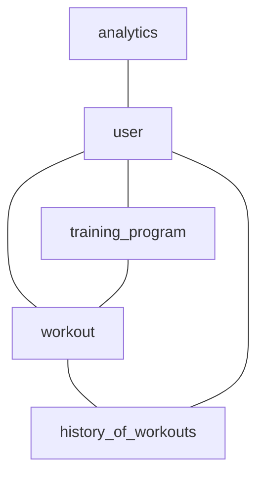

### Домен «Тренировки»


### Домен «Тренировки» с учётом связи между тренировками и инвентарём

#### Сущность «Тренировка» (Workout)

**Описание:** принадлежит одному пользователю, это конкретное событие активности (бег, плавание, йога и т. п.).

| Свойство | Тип | Описание |
| --- | --- | --- |
| id | UUID | Уникальный идентификатор тренировки. |
| userId | UUID | ID пользователя, которому принадлежит тренировка. Связь с User. |
| type | Enum | Тип тренировки: бег, плавание, йога и т. д. |
| date | DateTime | Дата и время начала тренировки. |
| duration | Integer | Продолжительность тренировки в минутах. |
| distance | Float | Пройденное расстояние в километрах (для беговых тренировок). |
| calories | Integer | Количество сожжённых калорий. |
| notes | String | Примечания пользователя о тренировке (макс. 1000 символов). |
| equipment |Array<UUID>| ID инвентаря, использованного во время тренировки. Связь с Equipment. |

**Пример:**
```json
{
  "id": "750e8400-e29b-41d4-a716-446655440000",
  "userId": "750e8400-e29b-41d4-a716-446655440001",
  "type": "бег",
  "date": "2025-06-01T08:00:00Z",
  "duration": 30,
  "distance": 5.2,
  "calories": 250,
  "notes": "Бег по парку, хорошая погода.",
  "equipment": ["750e8400-e29b-41d4-a716-446655440003", "750e8400-e29b-41d4-a716-446655440004"]
}
```

#### Сущность «История тренировок» (History of workouts)

**Описание:** данные о всех тренировках пользователя.

| Свойство | Тип | Описание |
| --- | --- | --- |
| userId | UUID | ID пользователя, которому принадлежит история тренировок. Связь с User. |
| workouts | Array | Массив ID тренировок. Связь с Workout. |

**Пример:**
```json
{
  "userId": "850e8400-e29b-41d4-a716-446655440001",
  "workouts": ["850e8400-e29b-41d4-a716-446655440002", "850e8400-e29b-41d4-a716-446655440003"]
}
```

#### Сущность «Программа тренировок» (Training program)

**Описание:** план занятий на неделю, месяц.

| Свойство | Тип | Описание |
| --- | --- | --- |
| id | UUID | Уникальный идентификатор программы тренировок. |
| userId | UUID | ID пользователя, которому принадлежит программа тренировок. Связь с User. |
| name | String | Название программы тренировок (макс. 50 символов). |
| startDate | Date | Дата начала программы тренировок. |
| endDate | Date | Дата окончания программы тренировок. |
| workouts | Array | Массив тренировок в программе. Связь с Workout. |

**Пример:**
```json
{
  "id": "950e8400-e29b-41d4-a716-446655440000",
  "userId": "950e8400-e29b-41d4-a716-446655440001",
  "name": "Программа на неделю",
  "startDate": "2025-06-01",
  "endDate": "2025-06-07",
  "workouts": [
    {
      "type": "бег",
      "date": "2025-06-01T08:00:00Z",
      "duration": 30
    },
    {
      "type": "плавание",
      "date": "2025-06-02T18:00:00Z",
      "duration": 45
    }
  ]
}
```

#### Сущность «Аналитика» (Analytics)

**Описание:** анализ прогресса тренировок и рекомендации.

| Свойство | Тип | Описание |
| --- | --- | --- |
| userId | UUID | ID пользователя, для которого проводится аналитика. Связь с User. |
| metrics | Object | Метрики прогресса тренировок: { totalDistance: Float, totalCalories: Integer, averageDuration: Integer }. |
| recommendations | Array | Рекомендации для улучшения тренировок. |

**Пример:**
```json
{
  "userId": "a50e8400-e29b-41d4-a716-446655440001",
  "metrics": {
    "totalDistance": 25.6,
    "totalCalories": 1250,
    "averageDuration": 35
  },
  "recommendations": ["Увеличить продолжительность тренировок", "Добавить силовые упражнения"]
}
```