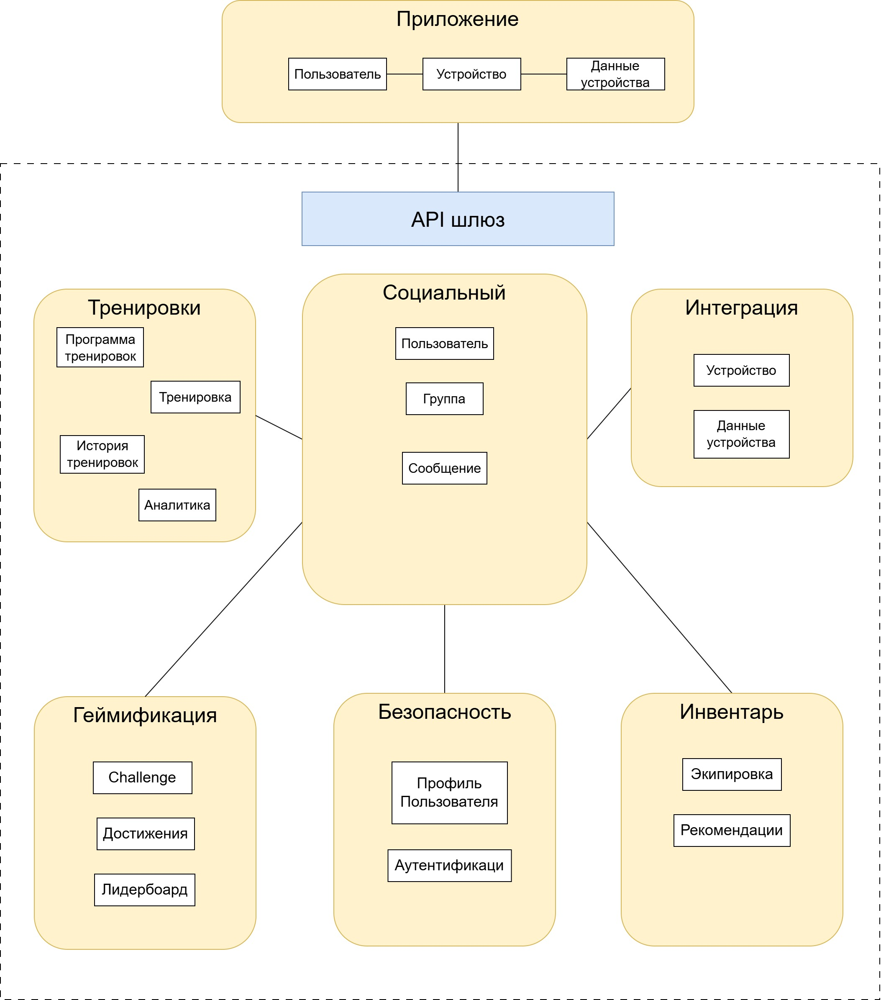

# Концептуальная архитектура.

В качестве пользовательского интерфейса (frontend) будет выступать мобильное приложение.

В качестве серверной части (Backend) будут выступать микросервисы с единой точкой входа API Gateway.

Система будет представлять собой модульное облачное решение с микросервисной архитектурой, обеспечивающее гибкость, масштабируемость и безопасность.

На диаграмме ниже показана доменная модель 

## Приложение
Основные сущности приложения:
* Пользователь (User) - основная сущность в системе.
* Устройство (Device) - Представляет устройство или источник данных (например, Health Connect, Apple Health, или конкретный фитнес-трекер, если поддерживается).
* Данные устройства  (DeviceData) - Хранит данные, полученные с устройств (например, шаги, пульс, калории, сон и т.д.).

## Домен Социальный
Ядром приложения будет социальный домен с основными сущностями:
* Пользователь - центральная сущность связана практически со всеми другими объектами (тренировки, группы, устройства, инвентарь) содержит минимальные данные.
* Группа - социальная группа пользователей по интересам обеспечивает социальное взаимодействие.
* сообщение - отправленное сообщение пользователем в группу или другому пользователю.

## Домен Тренировки
Основные сущности домена:
* Тренировка - принадлежит одному пользователю, это конкретное событие активности (бег, плавание, йога и т.п.)
* История тренировок - Данные о всех тренировках пользователя
* Программа тренировок - План занятий на неделю, месяц.
* Аналитика - Анализ прогресса тренировок и рекомендации

## Домен Геймификация
Отвечает за мотивацию пользователей через игровые механики.
Основные сущности домена:
* Достижения - Награда за выполнение цели (например пробеги 100 км. проплыви 2 км и т.п.)
* Лидерборд - рейтинг пользователей по активности. Может быть например Еженедельный/ ежемесячный, по дистанции, по времени, географичесйкий.
* Challenge (испытание) - временное соревнование группы или персональный. Например: Весенний марафон пробежать 50 км за месяц. 

## Домен Безопасность
Отвечает за защиту данных пользователя
сущности домена
* Приватный профиль - содержит публичные и персональные данные пользователя, настройки приватности, e-mail.
* Аутентификация - Предоставление пользователю доступа к ресурсам, вход в систему и подтверждение личности.

## Домен Инвентарь
Этот домен отвечает за учет экипировки пользователя, рекомендации по ее замене и интеграцию с приложениями для покупок.
Ключевые сущности:
* Экипировка - Спортивный инвентарь, кроссовки, велосипед, мяч и т.п.
* Рекомендации - Советы обновить заменить или дополнить на основе износа.

## Домен Интеграция
Этот домен отвечает за подключение внешних устройств (часы, датчики, трекеры) и их обработку. 
Ключевые сущьности:
* Устройство - физическое или виртуальное устройство, например часы, трекер.
* Данные устройства - Показатели полученные с устройства, пульс, шаги, расстояние. Данные привязываются к тренировке если они получены во время тренировки.
